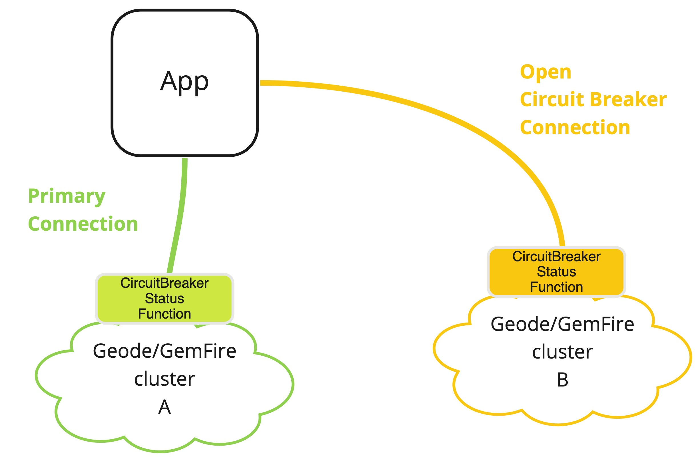

# dataTx-geode-circuitbreaker-demo

BETA example demo application on how to implement a [circuit breaker design pattern](https://en.wikipedia.org/wiki/Circuit_breaker_design_pattern) with [Apache Geode](https://geode.apache.org)/[GemFire](https://pivotal.io/pivotal-gemfire).

This application demonstrates switching between cluster A to cluster B 
when A is down. It then switches back to A when it is available again.

The application uses [Spring Data Geode](https://spring.io/projects/spring-data-geode) to managed the 
connection to a Apache Geode/GemFire cluster. Apache Geode supports connecting to
multiple cluster using a [Pool](https://geode.apache.org/releases/latest/javadoc/org/apache/geode/cache/client/Pool.html).
Two pools (A and B) are used to maintain connections to clusters.

On the server cluster a simple [Apache Geode/GemFire function](https://geode.apache.org/docs/guide/11/developing/function_exec/function_execution.html) is used to determine
if the cluster is available. See [CircuitBreakerStatusFunc](circuitBreakerFunctions/src/main/java/io/pivotal/services/dataTx/circuitBreaker/functions/CircuitBreakerStatusFunc.java) function for details.
The Function is used to execute on either Pool A or B.
 
Based on detected failures from the function execution status checks, the Spring Data Geode connect context is switched dynamically between the two clusters.

